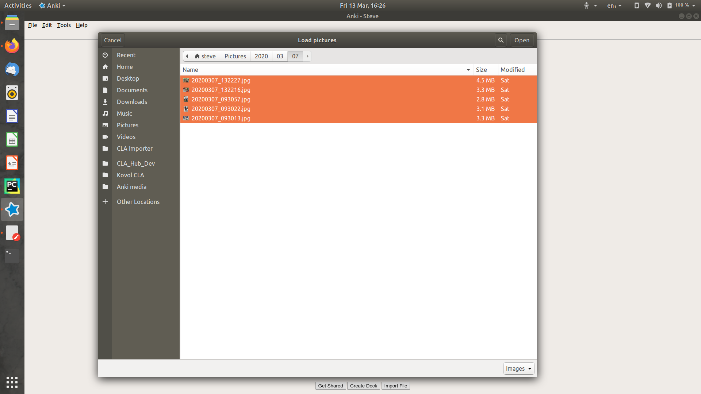
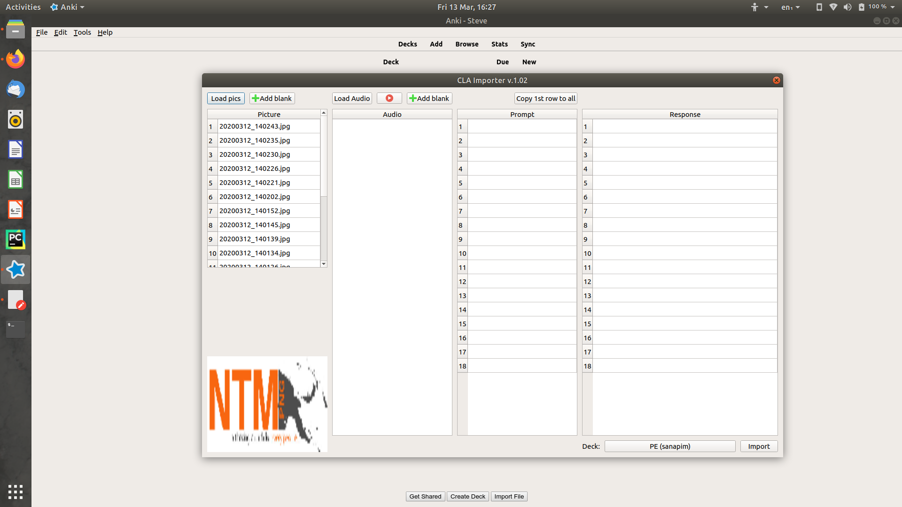
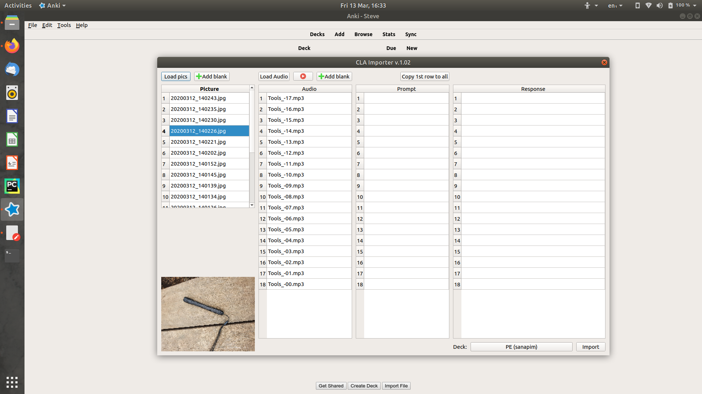
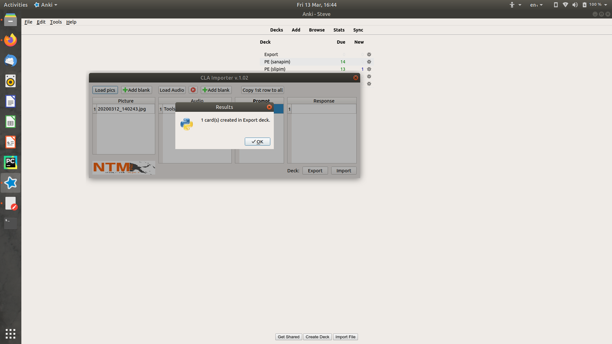

# Anki bulk importer

An Add-on for [Anki](https://apps.ankiweb.net/) that provides a user-friendly front end for Anki's import function for 
creating multimedia cards easily in batches. Each card will have a text prompt and image on the front and audio with a 
text response on the back.

This add-on was designed for language learners who need to created batches (20 a day is our goal) of cards that
emphasise hearing spoken language over interacting with written language.
Our team is busy learning a remote, unwritten language and thus we need to create all our own practice material.

**Confirmed working in Anki Version 2.1.0beta36**

- Images and audio can be previewed, no need to rename files to something recognisable
- Images and audio can be moved around so they match, no need to order them in a file explorer
- Images are automatically scaled to be suitable for a flashcard (Not HD!)
- Images and audio are added to Anki's collections.media folder
- Cards are created using a 'CLA card' template (CLA stands for Culture and Language Aquisition)

Once imported you are free to move or delete the source files as copies are now contained in Anki's media folder.

## How to use it
Bulk importer is designed for batch importing multimedia cards. It takes care of formatting file names in the way Anki 
expects, moves the files into Anki's collections folder and creates cards in the Deck you specify. Anki creates a 
'CLA card' (if it doesn't already exist) that consists of text (prompt) and an image on the front of the card and 
text (response) and audio on the back of the card.

I personally use it for new vocabulary. The front of the card shows me an image with a prompt like "what is this?". 
The back of the card then plays the audio clip for that card as the answer. I prefer the answer to be audio rather than
text because I'm learning to speak the language primarily and it helps train my ear.

#### What you should have ready
- Image for each card
- Audio each card
- A prompt for each card (What is this?, Describe this)

#### Step by step
- Open Bulk importer.
- Click load on either audio or image.
- Load the relevant media.
		  
- Media will appear in the relevent column.
		 
- Load the audio as well.
- Clicking on a picture filename will cause a preview of the image to appear in the bottom left corner. Selecting an audio row and clicking the play button will play a preview of the audio. Both the audio and picture tables can be rearranged by dragging rows around. Using the previews drag the images and audio around until they match.
         
You can write a prompt into any row. Often you'll want the same prompt for all the cards, in that case write something in the first row (eg. 'em wanem samting') and click copy first row to all to set the same prompt for all the cards. Every card requires a prompt.
You can write a response into any row which could be phonetics, or whatever you like. This will appear on the back of the card.
Select the deck you wish to import to.

- Response rows can be blank if you wish, often they will be - the audio is the main response for a CLA card.
If any rows are blank Bulk importer will ask you to confirm if this is what you intend.
Click import. A confirmation window will confirm how many cards were imported.
         

In the background Bulk importer will create cards in the Anki database and move the relevent files into Anki's media.collections folder. If a file with that name already exists in the database bulk importer will warn you about it. You can force it to proceed, but it's much better to quit and rename the file.
You don't have to keep the original pictures and images if you don't want to, a copy of them is stored in the Anki folder, you can safely move or delete the original files.

### Prerequisites
- [Anki 2.1](https://apps.ankiweb.net/)

### Installing
Open Anki, navigate to tools/Add-ons. Click 'get Add-ons' and enter the code **1312111882**. Anki will download the add-on.
 Reboot Anki and bulk importer will be available under tools.

Alternatively download bulk_importer.ankiaddon (a zip file) from this repository. Unzip it into Anki's add-on folder in
 a folder named bulk_importer. Next time Anki boots bulk importer will be available under tools.

OS | Default add-on folder location
-- | --------------------------------
Windows | C:\Users\user\AppData\Roaming\Anki2\addons21
Mac OS  | /home/user/.local/share/Anki2/addons21ibrary/Application Support/Anki2
Linux   | /home/user/.local/share/Anki2/addons21/

*AppData in Windows and .local in MacOS and Linux are hidden folders*

## License
This project is licensed under the GPL-3.0 License - see 
[License](https://github.com/stevetasticsteve/Anki_bulk_importer/blob/master/LICENSE)
for details.
You are free to use, edit and redistribute this add-on.

## Authors
* **Steve Stanley**, Missionary involved in language learning - Initial work